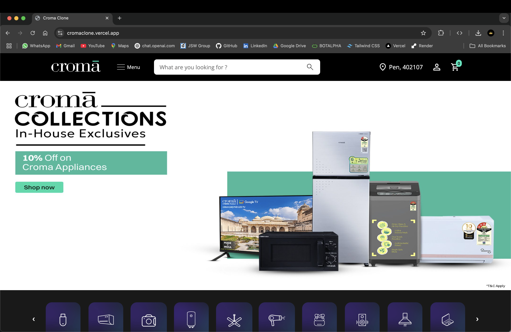

# Croma Clone 🛒

A full-stack e-commerce web app inspired by [Croma](https://www.croma.com/), built with the MERN stack.

## 📸 Snapshot



**Live Preview:** [https://cromaclone.vercel.app/](https://cromaclone.vercel.app/)

---

## ✨ Tech Stack

### 🚀 Frontend

- [React.js](https://reactjs.org/) – UI Library
- [Redux](https://redux.js.org/) – State Management
- [React Router](https://reactrouter.com/) – Routing
- [HTML](https://developer.mozilla.org/en-US/docs/Web/HTML), [CSS](https://developer.mozilla.org/en-US/docs/Web/CSS), [JavaScript](https://developer.mozilla.org/en-US/docs/Web/JavaScript)

### 🛠️ Backend

- [Node.js](https://nodejs.org/) – JavaScript Runtime
- [Express.js](https://expressjs.com/) – Web Framework
- [Socket.io](https://socket.io/) – Real-Time Features

### 💾 Database

- [MongoDB](https://www.mongodb.com/) – NoSQL Database

---

## 👥 Roles and Functionalities

### 👤 User

- Add to Cart & Buy Now
- Order History
- Wishlist
- Profile Management

### 🛍️ Seller

- Add Products
- Manage Listings
- Track Orders

### 🛠️ Admin

- Manage Products
- Monitor Users & Sellers
- Track Orders
- Dashboard Overview

---

## 💻 How to Run Locally

Follow these steps to run the **Croma Clone** on your local machine.

```bash

# 1. Clone the Repository
git clone https://github.com/siddharthbankar12/cromaclone
cd cromaclone

# 2. Install backend dependencies
cd backend
npm install

# 3. Install frontend dependencies
cd frontend
npm install

# 4. create .env file (example)
MONGO_URI=your_mongodb_uri
JWT_SECRET=your_jwt_secret

# 5. Start backend
cd backend
npm start

# 6. Start frontend
cd frontend
npm start

```

Let me know if:

- You want this as a downloadable `.md` file.
- You need help adjusting it to a monorepo or separate-folder architecture.
- You want deployment steps added for Vercel or Render.
